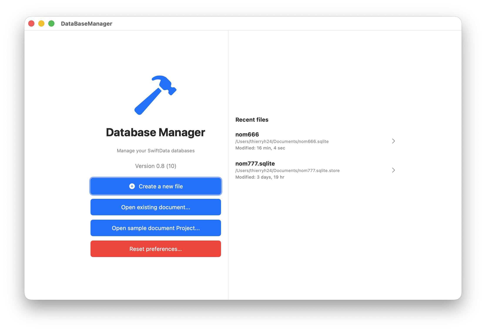
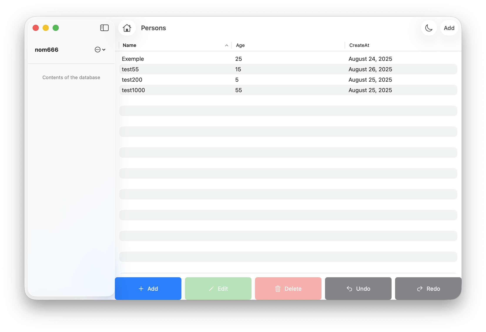

# DatabaseManager


Gestionnaire moderne pour bases de données SwiftData sur macOS.

<a href="README.md">English</a> | <a href="README_fr.md">Français</a>


<p align="center">

<p align="center">
<em>Welcome</em>
</p>
</p>

<p align="center">

<p align="center">
<em>Main</em>
</p>
</p>


## Présentation

**DatabaseManager** est une application macOS permettant de créer, ouvrir et gérer des bases de données au format SwiftData. L’application propose une interface moderne (SwiftUI), la gestion de fichiers récents, et la manipulation d'entités Person (nom, âge, date de création).

## Fonctionnalités

- Création d’une nouvelle base de données SwiftData
- Ouverture de bases existantes
- Liste des fichiers récents
- Ajout, modification, suppression de personnes
- Affichage des informations détaillées (nom, âge, date)
- Réinitialisation des préférences utilisateur
- Support du mode sombre

## Installation

1. Clone ce dépôt :
   ```sh
   git clone <url-du-repo>
